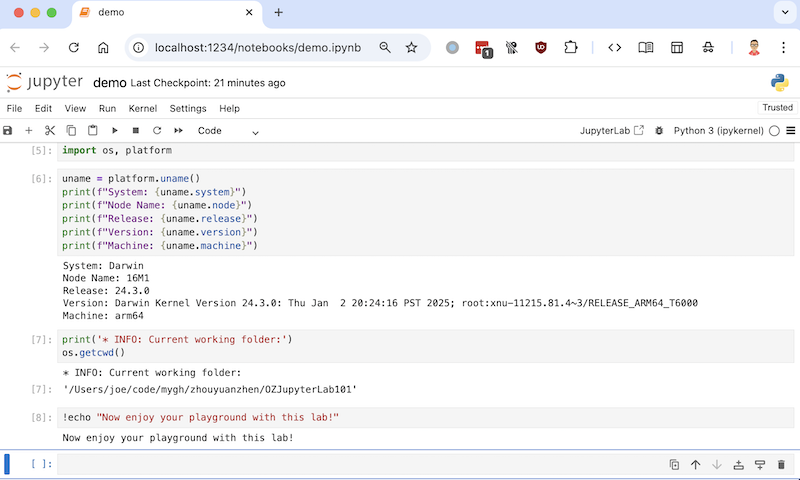

# OZJupyterLab101

Jupyter Lab 101 Quick Start Environment



## Quick Start

```shell
git clone git@github.com:zhouyuanzhen/OZJupyterLab101.git MyProject
cd MyProject

python3 -m venv .venv
.venv/bin/pip install -U pip

.venv/bin/pip install jupyter

# [ If you meet the speed issue, you may also use a pip mirror like below:  ]
.venv/bin/pip install -i https://mirrors.aliyun.com/pypi/simple jupyter
```

### Start the Jupyter Lab/Notebook

```shell
# [ Start the jupyter lab ]
.venv/bin/jupyter lab

# [ Start the jupyter notebook on port 1234 and open demo.ipynb ]
.venv/bin/jupyter notebook --ServerApp.port=1234 --ServerApp.file_to_run=demo.ipynb
```

***or***

```shell
# [ Activate the Python virtual environment ]
source .venv/bin/activate

# [ Start the Jupyter Lab ]
jupyter lab
```

# FAQ
